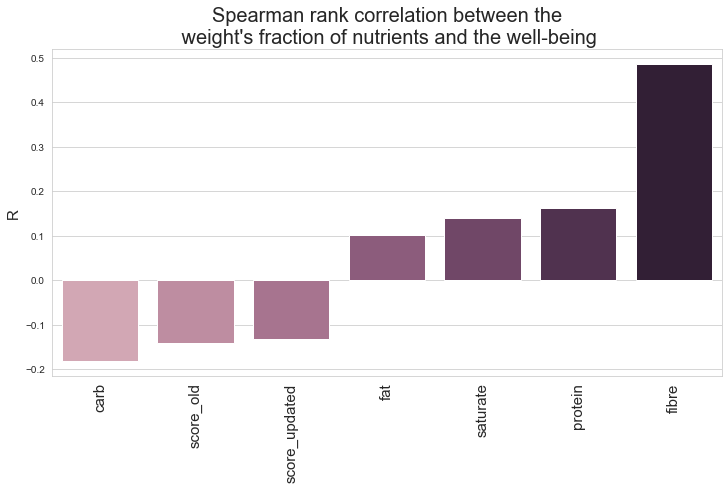
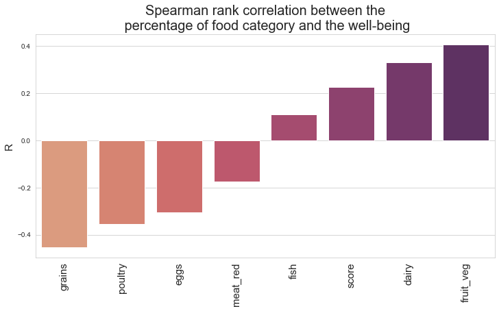
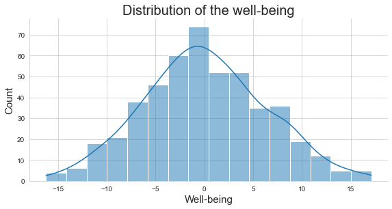

# Mens sana in corpore sano

"A healthy mind in a healthy body.”
Health departments recommend eating “well” for good health and well-being. However, we all know that “comfort food” (burgers, cookies, …), although being unhealthy, makes one feel good. Therefore, the following questions arise: Is eating healthy really essential to well-being? What is the influence of a food or nutrient on one’s mental health? Is there a specific nutrient that makes one happy? 

Let's find out!


## Healthy diet definition

First, we need to define what a healthy diet is.
There are plenty of websites, videos and articles on healthy diets. Among the various sources, we decided to use two different definitions of the composition of a healthy diet:\
Wikipedia, because it is a popular website on which many people look for information. Thus, people might take it as a reliable source towards healthy eating.
US Food and Drug Administration (FDA), an official source with scientific background.
The FDA updated their recommendations in March 2020. We decided to take both the original and the updated one to distinguish if one leads to better results.

Both websites state recommendations for daily nutrients intake. The Wikipedia article focuses on fruits, vegetables, grains, dairy, red meat, poultry, eggs and fish while the FDA one focuses on fat, fibre, carb, protein and saturated fats.

Each definition gave us a pipeline to follow to eat healthy:


The healthy scores were then computed as follows :


## Spearman's rank correlation (Change title plz)

First, let’s  compute the Spearman rank coefficient between the different nutrients as well as the Wikipedia score and the well-being of London residents. (barplot wiki)



The nutrient with the highest correlation with well-being is the fibre.  

Then, let’s plot the Spearman rank correlation between the different types of food and the well-being of London residents.




Here, the food with the highest positive correlation with well being are fruits and vegetables. It makes sense, as most health offices recommend eating plenty of fruits and vegetables.
On the other hand, grains are negatively correlated.

As vegetables and fruits are rich in fiber, it seems that both scores agree.
However, whole grains are also a great source of fiber while grains are negatively correlated with well-being. This might be due to the fact that most Londoners eat more refined grains. 

All nutrients and foods used are statistically significant predictors of well-being according to the Spearman rank correlation because the t-test p-value against the null hypothesis that the coefficient is equal to 0 is lower than 0.05. 


## Regressions (CHANGE TITLE)
Are nutrients and well-being correlated ? What about different foods and well-being ? We tried to predict well-being by fitting an ordinary least squares regression to nutrients as well as foods, FDA and Wikipedia scores. Unfortunately, it seems like our healthy scores are not correlated with well-being.


## classification well (0 ou 1), confusion matrix (CHANGE TITLE)

Having a look at the distribution of the well-being, we thought of classifying areas into happy (well-being>=0) and unhappy (well-being < 0).





## Welcome to GitHub Pages

You can use the [editor on GitHub](https://github.com/lnstreit/analysis_happiness_food/edit/gh-pages/index.md) to maintain and preview the content for your website in Markdown files.

Whenever you commit to this repository, GitHub Pages will run [Jekyll](https://jekyllrb.com/) to rebuild the pages in your site, from the content in your Markdown files.

### Markdown

Markdown is a lightweight and easy-to-use syntax for styling your writing. It includes conventions for

```markdown
Syntax highlighted code block

# Header 1
## Header 2
### Header 3

- Bulleted
- List

1. Numbered
2. List

**Bold** and _Italic_ and `Code` text

[Link](url) and 
```

For more details see [GitHub Flavored Markdown](https://guides.github.com/features/mastering-markdown/).

### Jekyll Themes

Your Pages site will use the layout and styles from the Jekyll theme you have selected in your [repository settings](https://github.com/lnstreit/analysis_happiness_food/settings). The name of this theme is saved in the Jekyll `_config.yml` configuration file.

### Support or Contact

Having trouble with Pages? Check out our [documentation](https://docs.github.com/categories/github-pages-basics/) or [contact support](https://github.com/contact) and we’ll help you sort it out.


